# 不同图像的去雾结果
## 图像1
暗通道均值半径不同对最终的去雾结果有所影响，一定范围内，半径越大，结果越好，半径越大，暗通道中的同一区域也会越大
### 源图像：
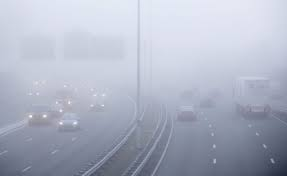
### 暗通道均值半径为5 10 20
####  暗通道图像：
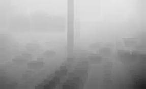  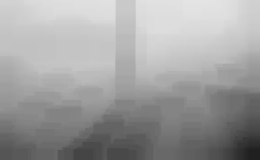  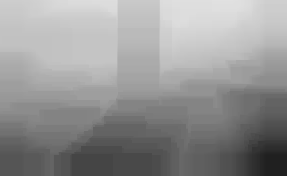
#### 去雾结果图像：
  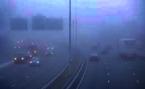  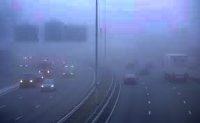  
## 图像2
### 源图像：
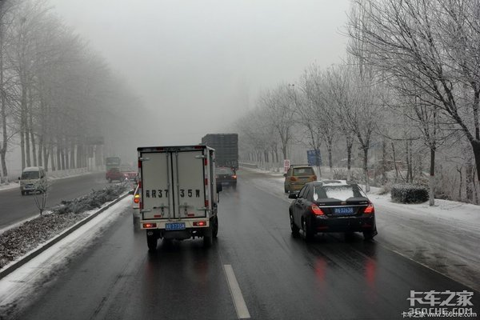
### 暗通道均值半径为5 10 20
####  暗通道图像：
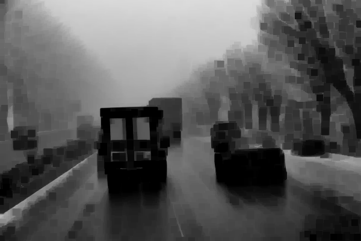  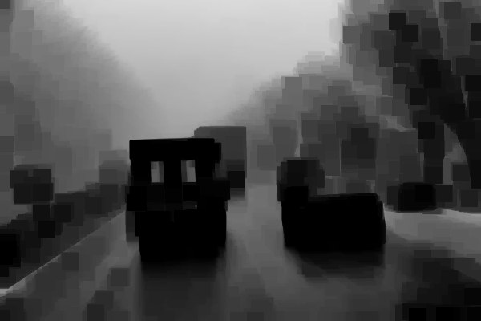  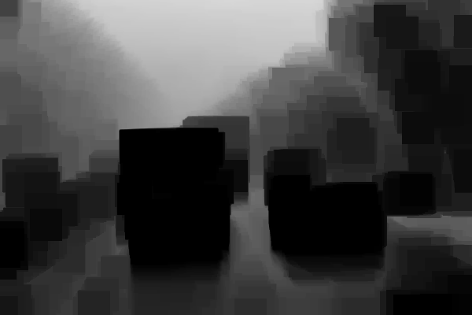
#### 去雾结果图像：
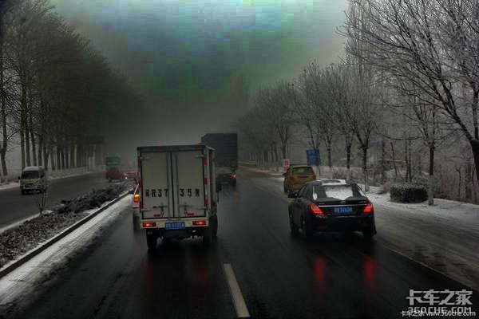  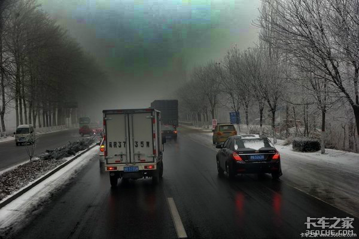  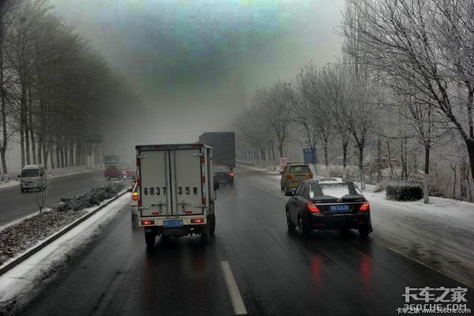
## 图像3
### 源图像：

### 暗通道均值半径为5 10 20
####  暗通道图像：
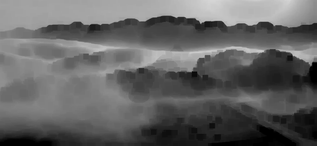  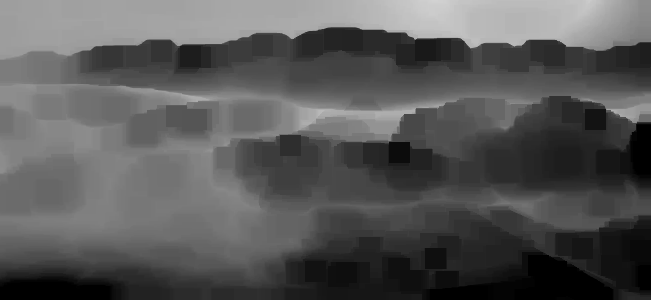  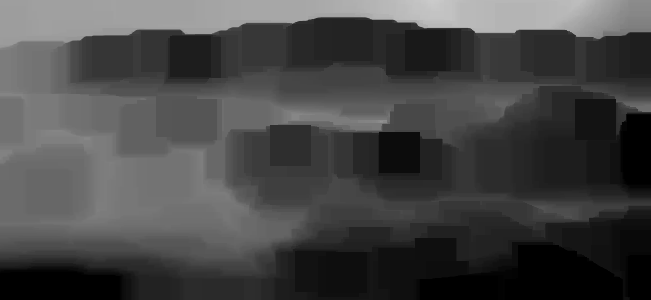
#### 去雾结果图像：
    
