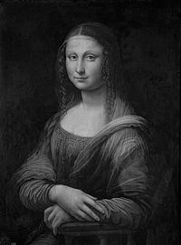
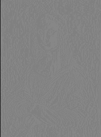
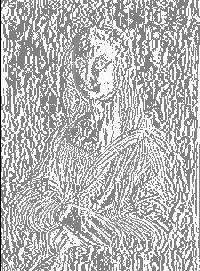

# DPCM
## 原图

## bit为1
### 预测图

### 插值图

### PNSR和SSIM
PNSR:-42.15642589797251
SSIM: 0.0025954989814665577
## bit为2
### 预测图

### 插值图

### PNSR和SSIM
PNSR: -36.135825984692886
SSIM: 0.00517888975497839
## bit为4
### 预测图

### 插值图

### PNSR和SSIM
PNSR: -24.09462615813364
SSIM: 0.020425682513811213
## bit为8
### 预测图

### 插值图

### PNSR和SSIM
PNSR: -0.012226505015142344
SSIM: 0.25049167662360916

